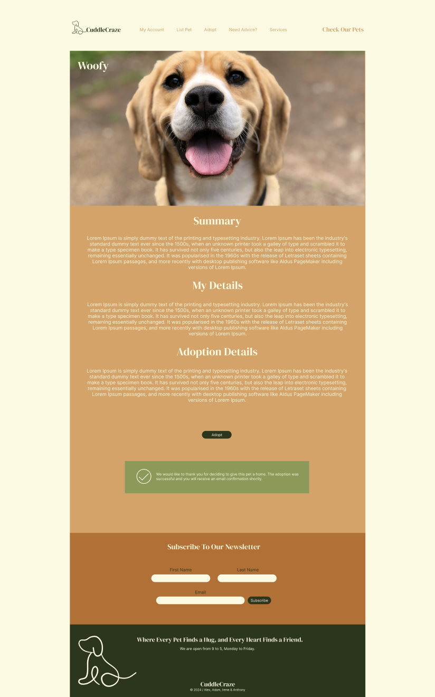

# CuddleCraze (Prototype Phase)

## Description

Where Every Pet Finds a Hug, and Every Heart Finds a Friend.

CuddleCraze is a brand new application to help people make connections via mankind's best friend. Whether you're a dog owner who needs to re-home their beloved pet, or a would-be adopter looking to welcome a new best friend into your life, CuddleCraze is there for you.

We allow users to list dogs that need re-homing in our Doggie Database, providing forms to cataglogue their age, breed, special requirments etc. Adopters can then scroll through this database, filtering it by location or breed, to find a dog to suit what they and their family can provide. Dogs can be marked as reserved once they've found a new home, and users can even save dogs to their favourites.

Each dog has its own dynamically-created page with their information and even a random dog fact, for fun!

We also provide an email service allowing users to make enquiries about their chosen dog, connecting users whilst also maintaining internet privacy

## URL

Check the deployed web app at the following link: https://cuddle-craze.netlify.app/#/

## APIs

- REST API - provides a dynamically-created YouTube video with tips on how to care for your chosen breed
- Random Dog Facts - provides a random dog fact for fun and flavour

## Libraries/Technologies

- EmailJs - allows users to send an email to the CuddleCraze team at the push of a button. The team will then use this email to connect the adopter user with the adoptee user
- Express API - used to allow dynamic updating of the JSON files in the application 

## Installation

Installation not required, use the deployed link listed under Usage.

# Demo

## Usage

The site has two main functions.

- Adopting a dog

By clicking Adopt in the navbar, the user will be taken to our doggie database, filling with dynamically-created cards of all the dogs in our system. Using filters at the top of the page, the user can refine their search by breed or location. Clicking on the dog card will take them to the dog's profile page, with all their information, a dog video on how to take care of that particular breed, and an email form they can use to contact us, requesting us to connect them with their chosen dog's current owner

- Listing a dog

If a user makes an account, they can then list an animal they wish to re-home. Clicking on the Account tab on the Navbar will take you to your personal page. From there, click a button called 'Add Pet', which will prompt you for information about your dog. Submit, and your dog will be added to our database!

## Credit

Alex Grigore - Tech Lead, Design, User Interface, User Experience, APIs

Irene Bazaga - Documentation, Design, User Experience, User Interface

Anthony Burgess - User Experience, Design, Documentation

Adam Blampied - APIs, User Experience, Documentation

## Licence

MIT License

Copyright (c) 2024 Alex Grigore, Irene Bazaga, Anthony Burgess, Adam Blampied

Permission is hereby granted, free of charge, to any person obtaining a copy
of this software and associated documentation files (the "Software"), to deal
in the Software without restriction, including without limitation the rights
to use, copy, modify, merge, publish, distribute, sublicense, and/or sell
copies of the Software, and to permit persons to whom the Software is
furnished to do so, subject to the following conditions:

The above copyright notice and this permission notice shall be included in all
copies or substantial portions of the Software.

THE SOFTWARE IS PROVIDED "AS IS", WITHOUT WARRANTY OF ANY KIND, EXPRESS OR
IMPLIED, INCLUDING BUT NOT LIMITED TO THE WARRANTIES OF MERCHANTABILITY,
FITNESS FOR A PARTICULAR PURPOSE AND NONINFRINGEMENT. IN NO EVENT SHALL THE
AUTHORS OR COPYRIGHT HOLDERS BE LIABLE FOR ANY CLAIM, DAMAGES OR OTHER
LIABILITY, WHETHER IN AN ACTION OF CONTRACT, TORT OR OTHERWISE, ARISING FROM,
OUT OF OR IN CONNECTION WITH THE SOFTWARE OR THE USE OR OTHER DEALINGS IN THE
SOFTWARE.

## Badges

